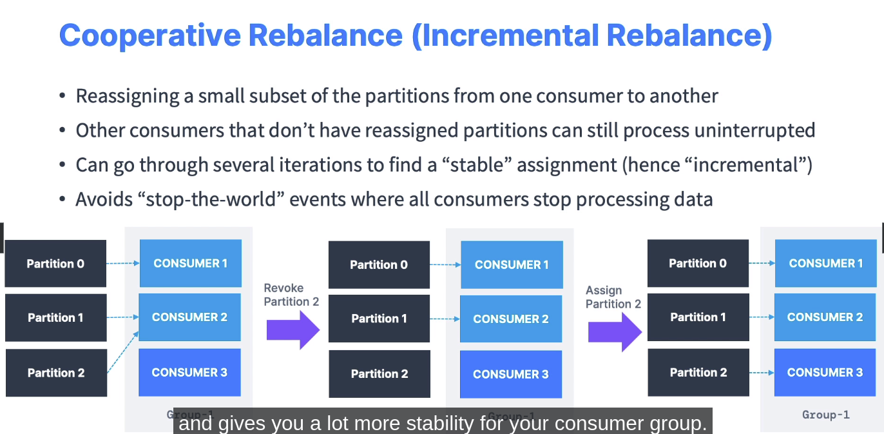
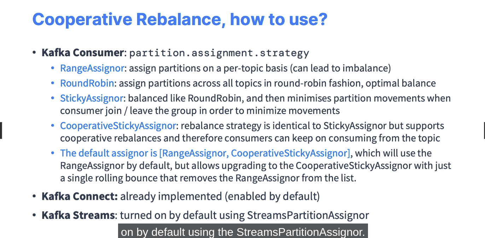
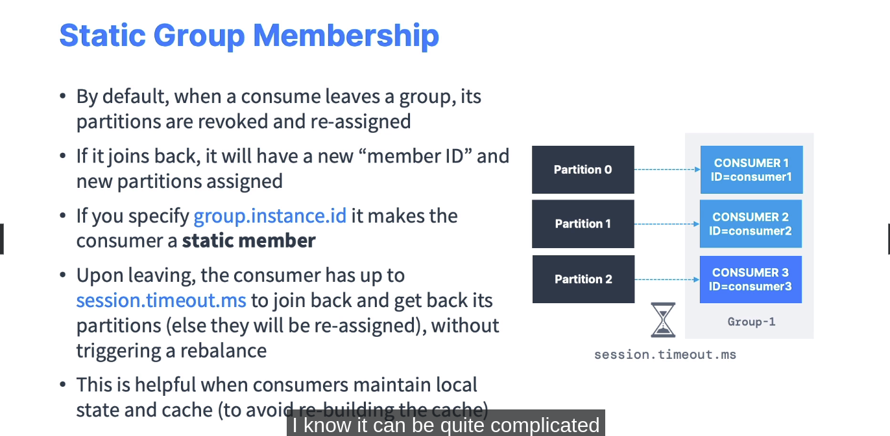
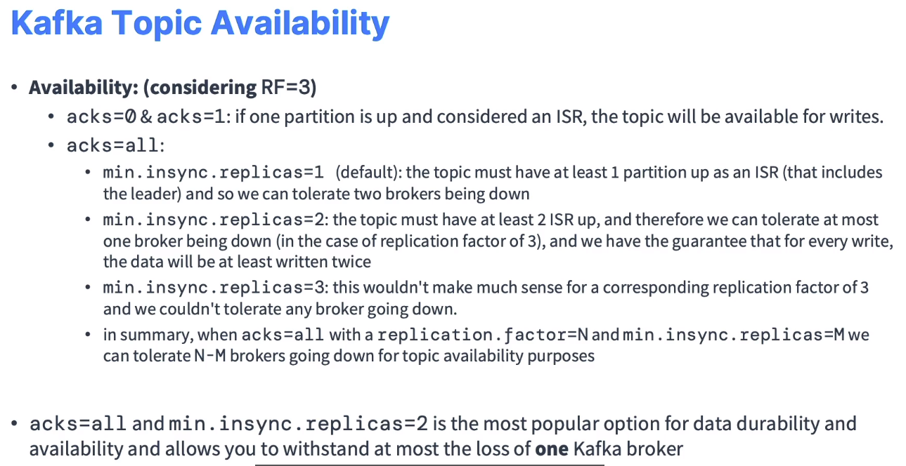

[Cài đặt với Docker](https://learn.conduktor.io/kafka/how-to-start-kafka-using-docker/)

# kafka-topics 

kafka-topics 

kafka-topics --bootstrap-server localhost:9092 --list 

kafka-topics --bootstrap-server localhost:9092 --topic first_topic --create

kafka-topics --bootstrap-server localhost:9092 --topic second_topic --create --partitions 3

kafka-topics --bootstrap-server localhost:9092 --topic third_topic --create --partitions 3 --replication-factor 2

## Create a topic (working)
kafka-topics --bootstrap-server localhost:9092 --topic third_topic --create --partitions 3 --replication-factor 1

## List topics
kafka-topics --bootstrap-server localhost:9092 --list 

## Describe a topic
kafka-topics --bootstrap-server localhost:9092 --topic first_topic --describe

## Delete a topic 
kafka-topics --bootstrap-server localhost:9092 --topic first_topic --delete
## (only works if delete.topic.enable=true)


# 2. PRODUCING

kafka-topics --bootstrap-server localhost:9092 --topic first_topic --create --partitions 1

## producing without keys (keys is null)
kafka-console-producer --bootstrap-server localhost:9092 --topic first_topic 
> Hello World
>My name is Conduktor
>I love Kafka
>^C  (<- Ctrl + C is used to exit the producer)


## producing with properties
kafka-console-producer --bootstrap-server localhost:9092 --topic first_topic --producer-property acks=all
> some message that is acked
> just for fun
> fun learning!


## producing to a non existing topic

### If I produce to a topic that does not exist, by default will see a Warning and Kafka will auto create the topic (Partition: 1, RF: 1)

kafka-console-producer --bootstrap-server localhost:9092 --topic new_topic
> hello world!

## our new topic only has 1 partition
kafka-topics --bootstrap-server localhost:9092 --list
kafka-topics --bootstrap-server localhost:9092 --topic new_topic --describe


## edit config/server.properties or config/kraft/server.properties
## num.partitions=3

## produce against a non existing topic again
kafka-console-producer --bootstrap-server localhost:9092 --topic new_topic_2
hello again!

## this time our topic has 3 partitions
kafka-topics --bootstrap-server localhost:9092 --list
kafka-topics --bootstrap-server localhost:9092 --topic new_topic_2 --describe

## overall, please create topics with the appropriate number of partitions before producing to them!


## produce with keys
kafka-console-producer --bootstrap-server localhost:9092 --topic first_topic --property parse.key=true --property key.separator=:
>example key:example value
>name:Stephane

# 3. CONSUMING

## create a topic with 3 partitions
kafka-topics --bootstrap-server localhost:9092 --topic second_topic --create --partitions 3

## consuming
kafka-console-consumer --bootstrap-server localhost:9092 --topic second_topic

## other terminal
kafka-console-producer --bootstrap-server localhost:9092 --producer-property partitioner.class=org.apache.kafka.clients.producer.RoundRobinPartitioner --topic second_topic

(--property parse.key=true --property key.separator=:)

>>>
one
two
three
four
five
six

## consuming from beginning
kafka-console-consumer --bootstrap-server localhost:9092 --topic second_topic --from-beginning

>>> 
one
four
three
six
two
five

==> Hợp lý vì khi consume từ đầu thì consumer trên 3 partition khác nhau => Không có thứ tự
==> Nhìn kỹ sẽ thấy (1, 4) | (3, 6) | (2, 5) === RoundRobin

## display key, values and timestamp in consumer
kafka-console-consumer --bootstrap-server localhost:9092 --topic second_topic --formatter kafka.tools.DefaultMessageFormatter --property print.timestamp=true --property print.key=true --property print.value=true --property print.partition=true --from-beginning

>>>
CreateTime:1733281324839	Partition:1	null	one
CreateTime:1733281340845	Partition:1	null	four
CreateTime:1733281329484	Partition:0	null	three
CreateTime:1733281347521	Partition:0	null	six
CreateTime:1733281327786	Partition:2	null	two
CreateTime:1733281345336	Partition:2	null	five
CreateTime:1733281557413	Partition:1	 k1	value1

# 4. CONSOLE CONSUMER IN GROUP


## create a topic with 3 partitions
kafka-topics --bootstrap-server localhost:9092 --topic third_topic --create --partitions 3

## start one consumer
kafka-console-consumer --bootstrap-server localhost:9092 --topic third_topic --group my-first-application

## start one producer and start producing
kafka-console-producer --bootstrap-server localhost:9092 --producer-property partitioner.class=org.apache.kafka.clients.producer.RoundRobinPartitioner --topic third_topic

## start another consumer part of the same group. See messages being spread
kafka-console-consumer --bootstrap-server localhost:9092 --topic third_topic --group my-first-application


(d, e vào consumer 1, "g" vào consumer 2)
## start another consumer part of a different group from beginning
kafka-console-consumer --bootstrap-server localhost:9092 --topic third_topic --group my-second-application --from-beginning

## Chú ý về from-beginning:
--from-beginning: chỉ đọc từ đầu cho những consumer chưa từng đọc bất kỳ offset nào

Nếu chạy laị 1 lần nữa --from-beginning thì sẽ ko có gì xảy ra (vì đã được đọc trước đó, offset đã di chuyển tới message gần nhất - ko còn là beginning)


##############################
#####  CONSUMER GROUP    #####
##############################

## documentation for the command 
kafka-consumer-groups 

## list consumer groups
kafka-consumer-groups --bootstrap-server localhost:9092 --list
 
## describe one specific group
kafka-consumer-groups --bootstrap-server localhost:9092 --describe --group my-second-application

## describe another group
kafka-consumer-groups --bootstrap-server localhost:9092 --describe --group my-first-application

```shell
GROUP                TOPIC           PARTITION  CURRENT-OFFSET  LOG-END-OFFSET  LAG             CONSUMER-ID                                           HOST            CLIENT-ID
my-first-application third_topic     0          6               7               1               console-consumer-c7f27058-cf65-4dcc-8e7b-42c77920b919 /127.0.0.1      console-consumer
my-first-application third_topic     1          5               6               1               console-consumer-c7f27058-cf65-4dcc-8e7b-42c77920b919 /127.0.0.1      console-consumer
my-first-application third_topic     2          8               8               0               console-consumer-c7f27058-cf65-4dcc-8e7b-42c77920b919 /127.0.0.1      console-consumer
```

## start a consumer
kafka-console-consumer --bootstrap-server localhost:9092 --topic first_topic --group my-first-application

## describe the group now
kafka-consumer-groups --bootstrap-server localhost:9092 --describe --group my-first-application

## describe a console consumer group (change the end number)
kafka-consumer-groups --bootstrap-server localhost:9092 --describe --group console-consumer-10592

## start a console consumer
kafka-console-consumer --bootstrap-server localhost:9092 --topic first_topic --group my-first-application

## describe the group again
kafka-consumer-groups --bootstrap-server localhost:9092 --describe --group my-first-application


# Reset offsets
## look at the documentation again
kafka-consumer-groups

## describe the consumer group
kafka-consumer-groups --bootstrap-server localhost:9092 --describe --group my-first-application

## Thử xem trước kết quả - Dry Run: reset the offsets to the beginning of each partition
kafka-consumer-groups --bootstrap-server localhost:9092 --group my-first-application --reset-offsets --to-earliest --topic third_topic --dry-run

## Thực thi reset offsets cho 1 group nào đó - execute flag is needed
kafka-consumer-groups --bootstrap-server localhost:9092 --group my-first-application --reset-offsets --to-earliest --topic third_topic --execute

## describe the consumer group again
kafka-consumer-groups --bootstrap-server localhost:9092 --describe --group my-first-application

## consume from where the offsets have been reset
kafka-console-consumer --bootstrap-server localhost:9092 --topic third_topic --group my-first-application

## describe the group again
kafka-consumer-groups --bootstrap-server localhost:9092 --describe --group my-first-application


Kafka có batch size là 16kB, tức là nếu gửi đủ nhanh thì Kafka sẽ giữ lại các pair trong cùng 1 partition

Có 3 loại auto.offset.reset là
1. none: Phải có consumer group trước khi đọc
2. earlies: Begining
3. latest: Chỉ đọc message từ thời điểm bây giờ trở đi


Chạy 2 consumer trong group `example-consumer` cho topic `third_topic`

```bash
kafka-console-consumer --bootstrap-server localhost:9092 --topic third_topic --formatter kafka.tools.DefaultMessageFormatter --property print.timestamp=true --property print.key=true --property print.value=true --property print.partition=true --from-beginning --group=example-group
```

```
python kafka_consumer.py
```

```bash
$ kafka-consumer-groups --bootstrap-server localhost:9092 --describe --group example-group

GROUP           TOPIC           PARTITION  CURRENT-OFFSET  LOG-END-OFFSET  LAG             CONSUMER-ID                                           HOST            CLIENT-ID
example-group   third_topic     0          13              13              0               console-consumer-f53a9a8d-3e7b-4bbc-b7e7-2c9a69d81e78 /127.0.0.1      console-consumer
example-group   third_topic     1          21              21              0               console-consumer-f53a9a8d-3e7b-4bbc-b7e7-2c9a69d81e78 /127.0.0.1      console-consumer
example-group   third_topic     2          19              19              0               rdkafka-95c463ef-55c8-404a-9138-25aa48361884          /172.18.0.1     rdkafka
```





Khi thêm hoặc gỡ một consumer, bạn sẽ thấy các partition được tái phân phối. Với cooperative-sticky, số partition bị di chuyển sẽ ít hơn so với range hoặc roundrobin.


# Important settings
## Min insync replicas



==> Thực tế: acks = all, RF = 3, min.insync.replicas = 2 (chịu được tối đa 1 lỗi broker)


## Idempotent Producer là việc Kafka không xử lý duplicate từ Producer gửi lên


## Safe Kafka Producers Settings

Từ version 3.0+ thì đã cài mặc đinh, từ 2.8 trở xuống thì cần điều chỉnh cho phù hợp


## Message Compression (Nén)

Nên dùng cho production


Có thể áp dụng trên level của Broker hoặc level Topic
- Nếu áp dụng Broker level thì toan bộ topic sẽ được áp dụng
- Nếu áp dụng Topic level thì chỉ topic đó được áp dụng


- type = none => inefficient
- type = producer: Nên áp dụng vì không tốn thêm một lần ở broker giải mã sau đó mã hóa lại
- type = lz4 (ví dụ): Mất thêm 1 lần giải mã, rồi mã hóa lại theo thụât toán lz4 => Tốn CPU => Chỉ áp dụng cho trường hợp không kiểm soát rõ ràng producer có mã hóa không, nhưng vẫn muốn yên tâm mã hóa 1 lần ở broker
(https://blog.cloudflare.com/squeezing-the-firehose/)


## Linger.ms and batch.size


Mặc định, Kafka producers sẽ gửi tất cả các message ngay lập tức
==> Muốn bó thành các batch rồi gửi một thể (tăng hiệu suất, giảm số lần nén - vì chỉ nén cả batch)

2 tham sô ảnh hưởng tới cơ chế batching:

- linger.ms: là số ms sẽ chờ để gom message vào 1 batch. Mặc định là 0 - nghĩa là ko chờ gom - tức là gửi luôn


- batch.size


Message nào mà size lớn hơn batch size thì sẽ ko đc gom mà gửi luôn ngay

- snappy tốt cho các message dạng text (JSON, ...) - dạng log
- snappy có balance CPU / compress ratio


### note: Câu "cùng key tới cùng partition" sẽ sai khi số lượng partition bị thay đổi
Nếu vượt quá buffer (32 MB) thì khi gọi send() sẽ bị block.
Nếu thời gian bị block vượt quá 60s (60k ms) thì sẽ bắn ra exception

Nếu exception này xảy ra thì có nghĩa broker đã down hoặc quá tải và ko nhận thêm được request nữa


Có thể duplicate message

Make sure your processing is idempotent 

Nên dùng at least one


Các sử lý duplicate message:
Nên định nghĩa một trường unique ID

UNIQUE ID = record.topic() _ record.partition() _ record.offset()

Với việc kết hợp 3 trường này sẽ tạo ra ID unique ==> Xử lý được trùng

## Consume

### Thiết lập auto commit = True và ms = 5000

Như vậy sau mỗi 5000 ms thì sẽ thực hiện commit 1 lần, chú ý mỗi lần poll() phải đảm bảo tất cả các message của lần poll trước đó đã đươc processed. Vì nếu ko thì sẽ trở thành `at most one`. Nếu muốn làm các hành động bất đồng bộ thì nên tự quản lý commit (auto commit = false)

### Thiết lập auto commit = False và phải tự định nghĩa khi nào cần commit


### Replay data
if I want to replay data for a consumer, I should reset the offsets of the currently used consumer groups


## Which API is right for me?


Kết hợp với Schema registry để validate serializer, ...


Question

- To import data from external databases, I should use Kafka Connect Source
- To transform data from a Kafka topic to another one, I should use Kafka Stream
- To continuously export data from Kafka into a target database, I should use Kafka Connect Sink

- Kafka does not verify or parse incoming data