## 1. Chọn số lượng partition và Replication Factor
- Nếu thay đổi partition trong vòng đời của Topic
==> Bị mất nhất quán về "Cùng key vào cùng partition"

- Nếu thay đổi Replication Factor
==> Gây áp lực về space 

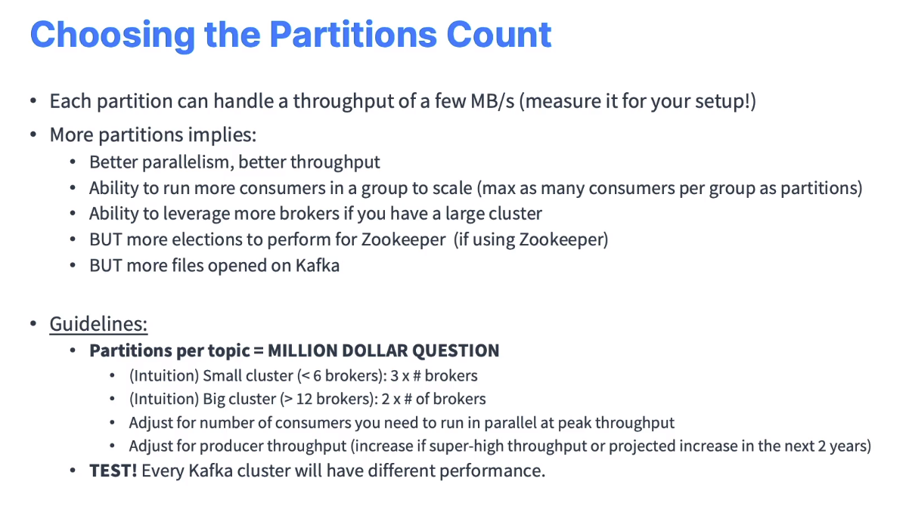

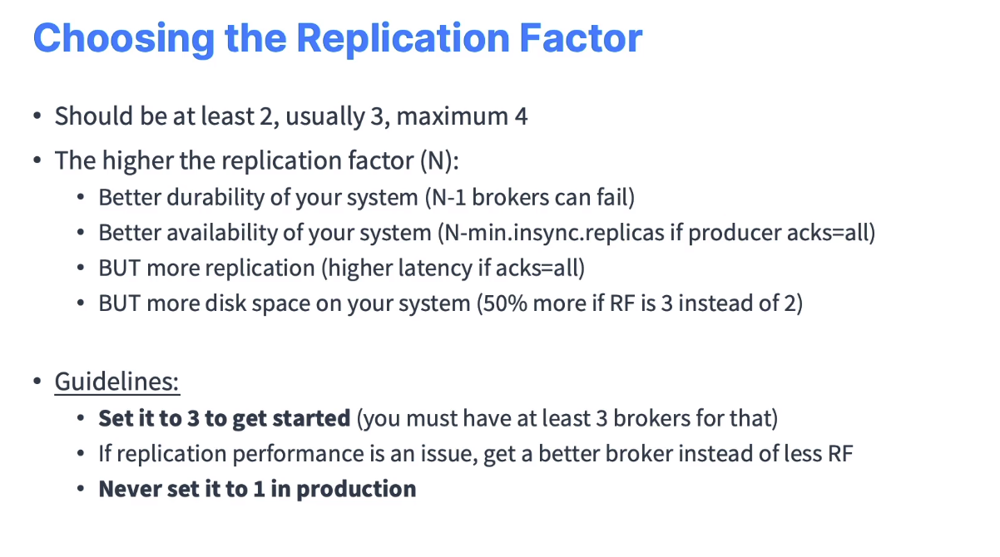

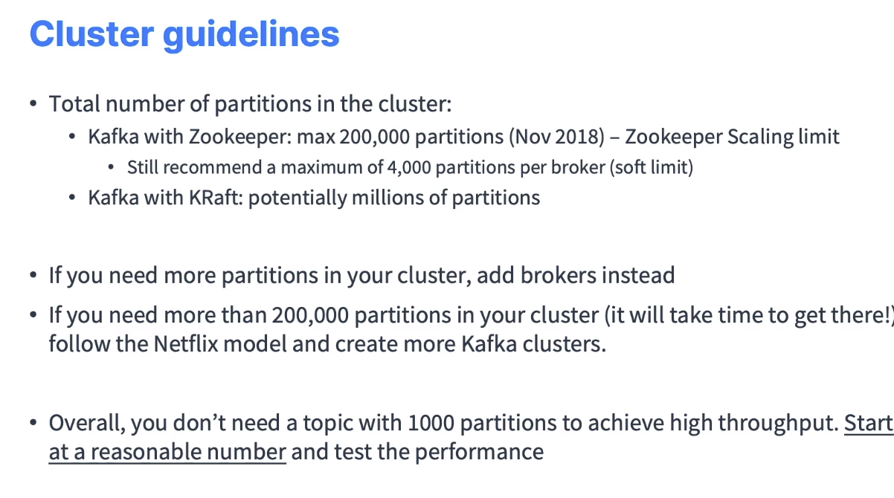

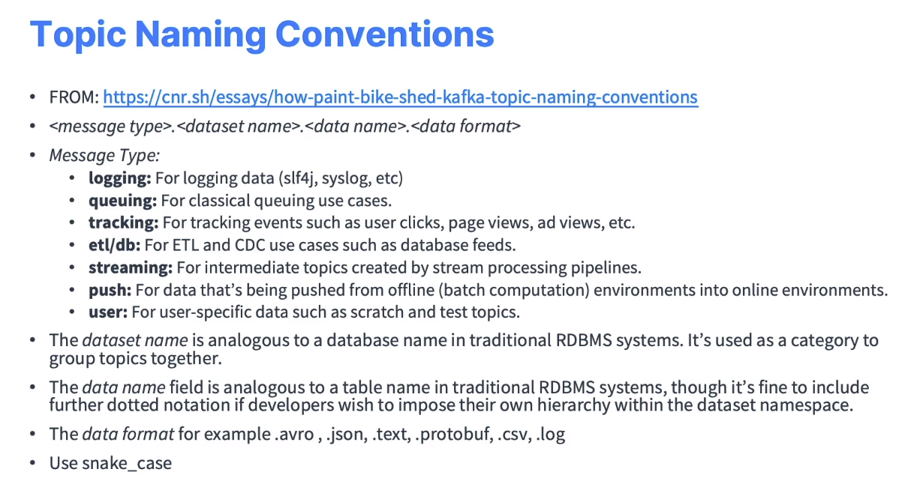

## UC 1. Movie Flix

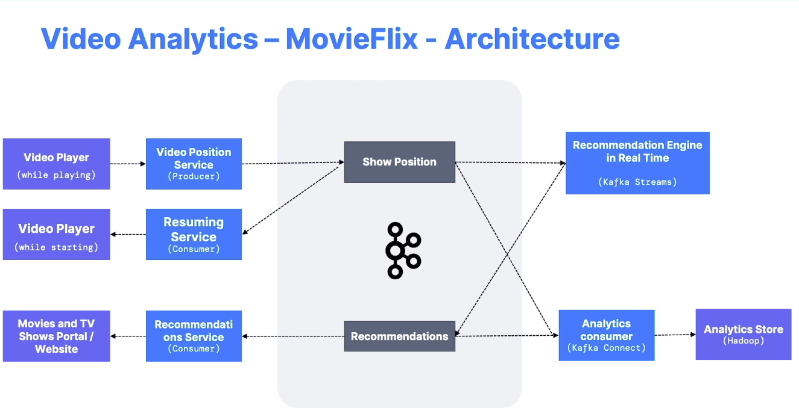

## UC 2. Taxi App
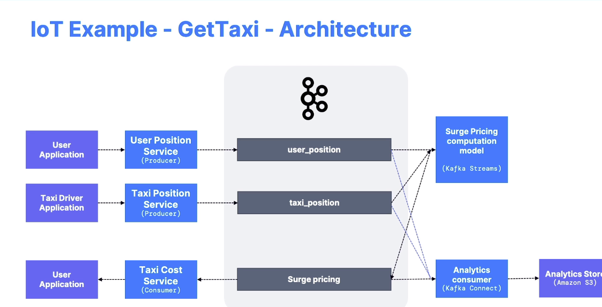

Câu hỏi: Muốn có 1 dịch vụ có thê consume đồng thời 2 topic, data ngoài lề (thời tiết, sự kiện, ..) và tính toán ==> `Kafka Stream`

## UC 3. Social media
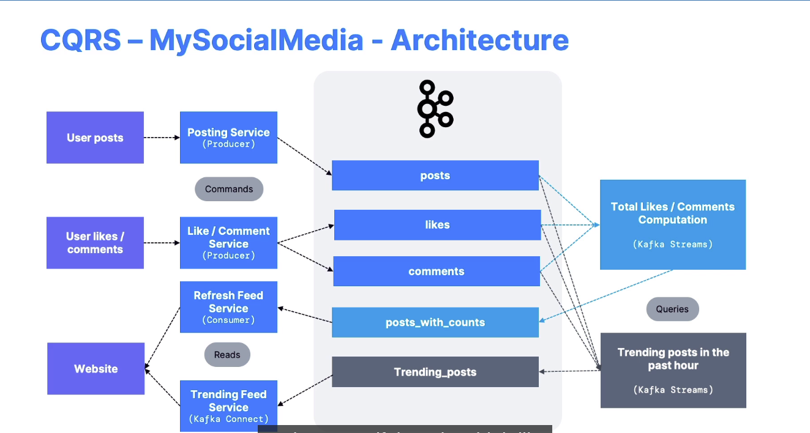
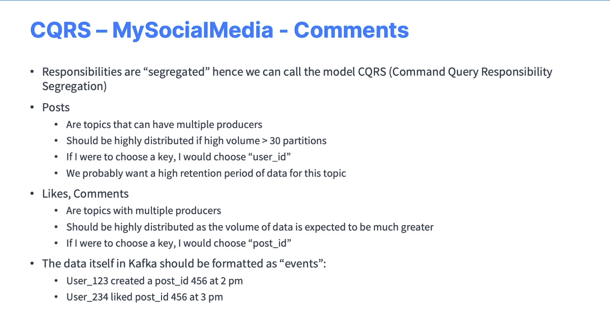

## UC 4. My Bank
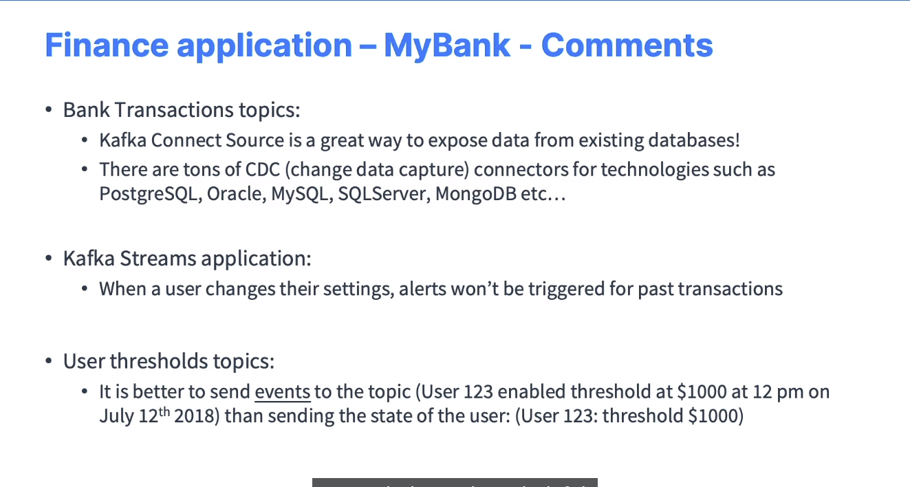
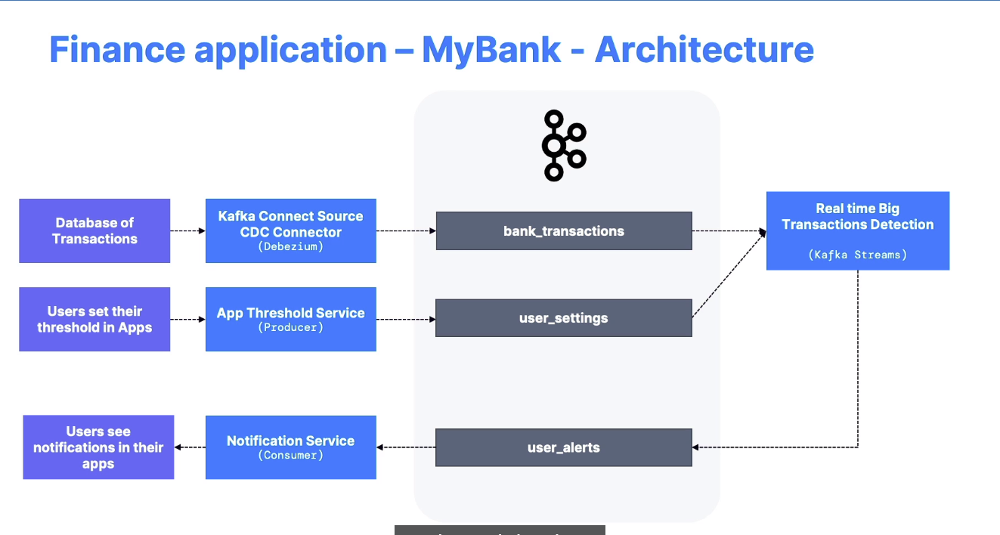

## UC 5. Big Data
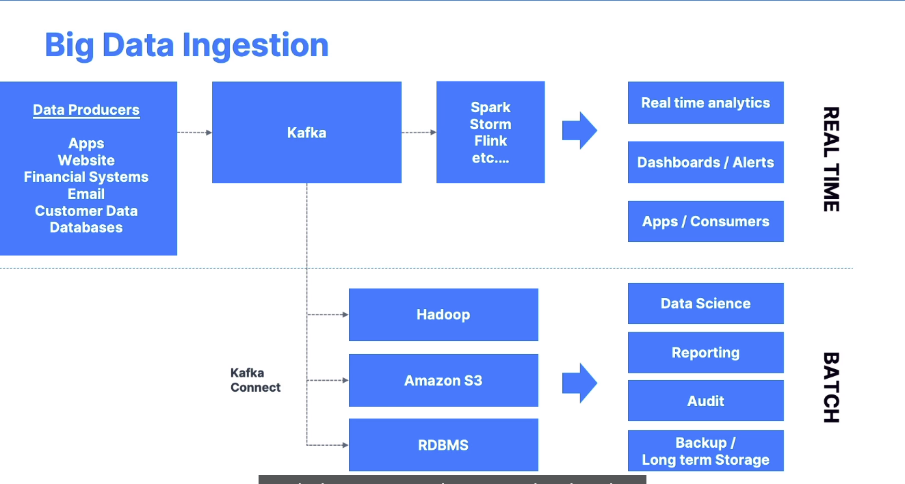

## UC 5. Logs and metrics
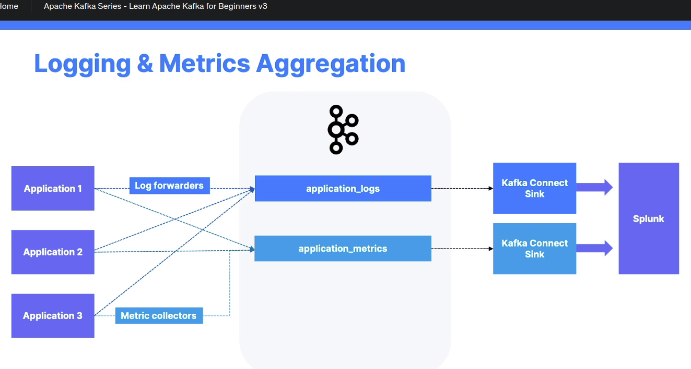