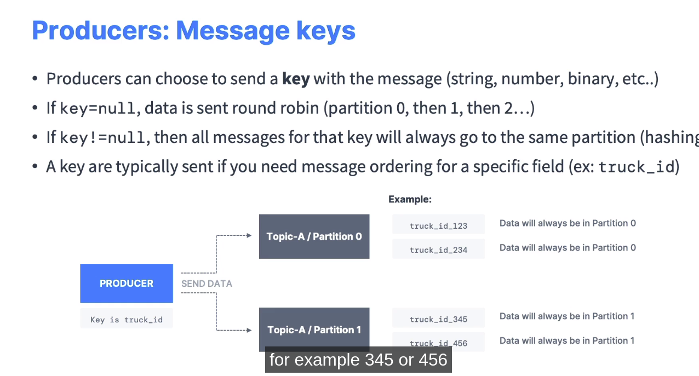
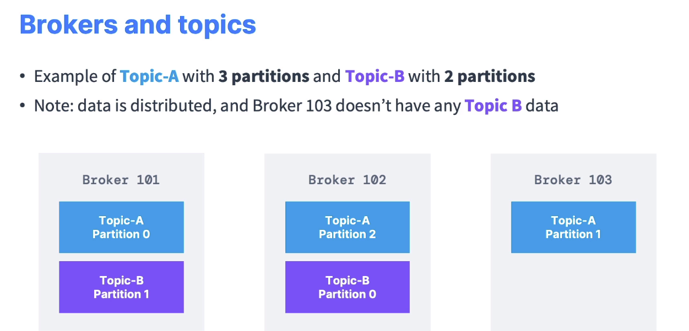

# Kafka Fundmentals

===================

Consumer pull message từ topic (dựa vào name) và tự biết lấy message từ broker nào.
Cần thống nhất 1 format chung cho message (ví dụ: key là integer, value là string), như vậy thì quá trình DeSerializer mới thực hiện chính xác và ko bị lỗi. Nếu muốn thay đổi format thì tạo ra 1 topic mới

## 10. Consumer group and Consumer offsets

Trong 1 **consumer group** thì các consumer đọc từ các partition độc lạp nhau, tức là Không có 2 consumer đọc cùng từ 1 nguồn partition
Hình phía trên là số lượng consumer < số lượng partition

==> 1 consumer có thể đọc từ 1-N partition

Nếu nhiều consumer hơn so với partition,
Cái số 4 sẽ trong trạng thái inactive và không hỗ trợ 3 cái còn lại, (nhưng chuyện thừa này là bình thường và possible)

### Multi consumer group

### Consumer offset

So sánh cách lưu offset giữa Multi consumer group và Single consumer group (trong Q&A.md)
[Stackoverflow question](https://stackoverflow.com/questions/45175424/how-multiple-consumer-group-consumers-work-across-partition-on-the-same-topic-in)

Offsets được lưu ứng với bộ (consumer group, topic, partition) tuple. Và được commit / lưu trong 1 **topic** riêng tên là  **__consumer_offsets**

Cần có 1 cơ chế để lưu offset ứng với mỗi group khác nhau (cũng là ứng với mỗi consumer trong mỗi group - vì consumer đọc tự các partition độc lập)

## 11. Broker and Topics

Số lượng partitions sẽ được phân phối đồng đều giữa các Brokers.
Và có thể sô lượng particion nhiều hơn số lượng Broker, khi đó 1 Broker có thể chứa nhiều partition của cùng 1 topic

    +-------------------+
    |      Topic X      |
    |    Partition 0    |
    |                   |
    |                   |
    |     Topic X       |
    |   Partition 1     |
    +-------------------+

CLIENT có thể kết nôi tới Cluster bằng cách kết nối tới 1 Broker bất kỳ. Broker được kết nối "đầu tiên" này gọi là "bootstrap broker", bootstrap broker sẽ trả về toàn bộ metadata về cluster như tất cả các broker còn lại, topics, partitions. Sau đó client có thể kết nối đến broker mà client mong muốn (hiểu đơn giản là lúc đầu chọn bừa 1 cái broker để lấy thông tin chi tiết, sau đó mới chọn đúng cái broker cần tìm)

## 12. Topic Replication Factor (RF)

- Tạo dư thừa để phòng trường hợp broker bị lỗi hoặc maintaince
- Thường Replication factor = 3
- Số lượng RF nhỏ hơn hoặc bằng số lượng Broker, nếu cô tình vượt quá sẽ bị lỗi. Tham khảo [Stackoverflow](https://stackoverflow.com/questions/59858907/kafka-number-of-partitions-are-more-than-no-of-broker)

Ví dụ Broker 102 hỏng thì Topic A vẫn còn nguyên 2 Partition 0, 1

- Chỉ 01 broker được chọn là Leader cho mỗi Partition, các Broker còn lại sẽ là replica (ứng với 1 partion, tất nhiên Broker còn lại có thể là leader của những partition khác)
- producer gửi data đến leader, không thể gửi đến replica
- Nếu replicate đủ nhanh sẽ được gọi là ISR (in-sync replica)

- **Đối với Consumer, mặc định sẽ đọc data từ leader**

Ở phiên bản mới, Consumer có thể chọn Replica gần nhất để đọc --> Giảm latency

## 13. Producer Acknowledgements & Topic Durability (Producer ACK và tính bền vững của Topic)

### Producer Acknowledgements 

### Topic Durability
Nếu có 3 Replication factor, nếu mất mát 2 thì vẫn có thể recover được
Tổng quát: Nếu có N Replication factor, mất N-1 vấn recover được

## 14. Zookeeper

## Kafka concepts

# Q&A

Question 11:
To read data from a topic, the following configuration is needed for the consumers

you only need to connect to one broker (any broker) and just provide the topic name you want to read from. Kafka will route your calls to the appropriate brokers and partitions for you!