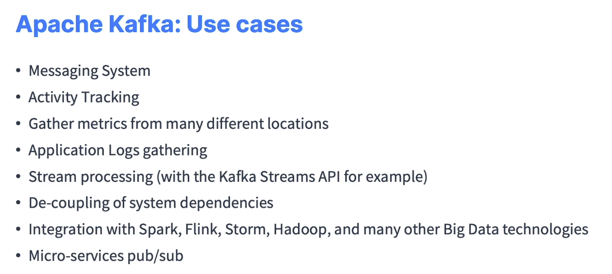
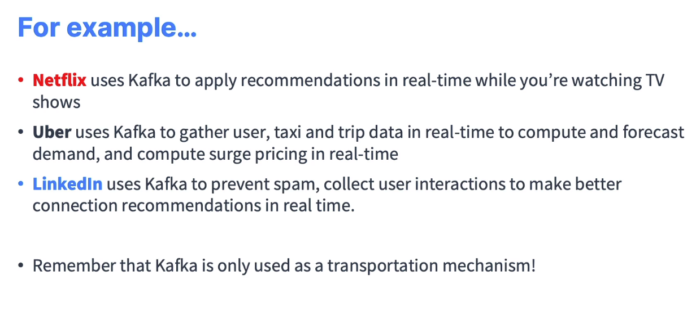

# Kafka Til

# 1. Introduction
- Apache Kafka là một hệ thống xử lý **dữ liệu thời gian thực** 

- Nó đã trở thành một phần quan trọng của **cơ sở hạ tầng cho các ứng dụng xử lý dữ liệu lớn và phân tán**. 

- Quản lý dữ liệu và xây dựng các ứng dụng có tính mở.

- Lưu trữ log và chia sẻ dữ liệu giữa các ứng dụng 

### Use cases

- Apache Kafka thường được ứng dụng trong nhiều lĩnh vực như:
Trong lĩnh vực Logistic: Khi thường xuyên phải sử dụng và xử lý số lượng đơn hàng không lồ mỗi ngày đến từ những nền tảng thương mại điện tử Ecommerce lớn đặc biệt là trong lúc các chương trình khuyến mại diễn ra.

==> Tận dung: Thời gian thực, dữ liệu lớn phân tán, ứng dụng tính mở

- Trong lĩnh vực Y học: Triển khai xây dựng những cảm biến theo dõi tình trạng của bệnh nhân bao gồm các thông số như nhịp tim, huyết áp hay thần kinh, ... giám sát sức khỏe người bệnh và đưa ra phác đồ điều trị kịp thời.

==> Tận dung: Lưu trữ log và chia sẻ dữ liệu giữa các ứng dụng 

- Trong Marketing: Lưu trữ dữ liệu về hành vi người dùng mạng xã hội và các công cụ tìm kiếm, những trình duyệt từ đó tạo ra các quảng cáo phù hợp.

==> Tận dung: Lưu trữ log và chia sẻ dữ liệu giữa các ứng dụng

### What Are Events?
An event is any type of action, incident, or change that's identified or recorded by software or applications. For example, a payment, a website click, or a temperature reading, along with a description of what happened.

In other words, an event is a combination of notification—the element of when-ness that can be used to trigger some other activity—and state. That state is usually fairly small, say less than a megabyte or so, and is normally represented in some structured format, say in JSON or an object serialized with Apache Avro™ or Protocol Buffers.

### Kafka and Events – Key/Value Pairs
Kafka is based on the abstraction of a distributed commit log. By splitting a log into partitions, Kafka is able to scale-out systems. As such, Kafka models events as key/value pairs. Internally, keys and values are just sequences of bytes, but externally in your programming language of choice, they are often structured objects represented in your language’s type system. Kafka famously calls the translation between language types and internal bytes serialization and deserialization. The serialized format is usually JSON, JSON Schema, Avro, or Protobuf.

Values are typically the serialized representation of an application domain object or some form of raw message input, like the output of a sensor.

Keys can also be complex domain objects but are often primitive types like strings or integers. The key part of a Kafka event is not necessarily a unique identifier for the event, like the primary key of a row in a relational database would be. It is more likely the identifier of some entity in the system, like a user, order, or a particular connected device.

This may not sound so significant now, but we’ll see later on that keys are crucial for how Kafka deals with things like parallelization and data locality.

- log-based?
- broker?  (node trong Kafka cluster)
Là thành phần cốt lõi của Apache Kafka, đại diện cho **máy chủ xử lý** và **lưu trữ dữ liệu** Kafka. Một cụm Kafka thường bao gồm nhiều Broker và mỗi Broker có thể xử lý sản xuất Producer và tiêu thụ Consumer dữ liệu. Broker chịu trách nhiệm quản lý và lưu trữ các Partition của các chủ đề Topics
- cluster? Một tập hợp các máy chủ Brokers bao gồm ít nhất 1 Broker nhưng thường là nhiều Broker hoạt động cùng nhau. Cluster Kafka có vai trò quan trọng trong việc cung cấp tính mở rộng, tính nhất quán và độ tin cậy cho việc xử lý dữ liệu thời gian thực.

- Partition?
Mỗi Topic có thể được chia thành **nhiều phân vùng**. Partition là một phần nhỏ của chủ đề và đóng vai trò quan trọng trong việc **phân tán dữ liệu và tăng hiệu suất**. Mỗi Partition được lưu trữ trển một Broker và **dữ liệu được đọc và ghi vào từng Partition một**.

- How Partitioning Works
Having broken a topic up into partitions, we need a way of deciding which messages to write to which partitions. Typically, **if a message has no key**, subsequent messages will be distributed round-robin among all the topic’s partitions. In this case, all partitions get an even share of the data, but we don’t preserve any kind of ordering of the input messages. If the message does have a key, then the destination partition will be computed from a hash of the key. This allows Kafka to guarantee that messages having the same key always land in the same partition, and therefore are always in order.

For example, if you are producing events that are all associated with the same customer, using the customer ID as the key guarantees that all of the events from a given customer will always arrive in order. This creates the possibility that a very active key will create a larger and more active partition, but this risk is small in practice and is manageable when it presents itself. It is often worth it in order to preserve the ordering of keys.
- Topic? => Có khác gì trong RabbitMQ ko?
Topic là một luồng dữ liệu độc lập và có thể được coi là một danh sách các tin nhắn liên quan. Giống trong RabbitMQ

- Producer?: Producer là thành phần của Apache Kafka cho phép ứng dụng gửi dữ liệu tới các Topic. Producer sử dụng giao thức Kafka **để kết nối với Broker và đưa dữ liệu vào các Partition của các chủ đề**

- Consumer? Là thành phần cho phép ứng dụng lấy dữ liệu từ các Topic Kafka. Consumer cũng sử dụng giao thức Kafka để kết nối với Broker và đọc dữ liệu từ các Partition. Có thể có nhiều Consumer đọc từ cùng 1 Topic và Kafka đảm bảo rằng mỗi tin nhắn chỉ được đọc **bởi 1 Consumer**.

- **???** Có cấu hình được các exchange, pattern khác nhau như trong RabbitMQ không? Trong rabbitMQ có thể cấu hình nhiều Consumer nhận message đồng thời (chứ ko chỉ 1 )

- ZooKeeper?: Là một hệ thống quản lý tập trung được sử dụng để quản lý và duy trì trạng thái của các Broker trong một cụm Kafka. Nó chịu trách nhiệm trong việc theo dõi và quản lý các Broker giúp Kafka hoạt động ổn định và đảm bảo tính nhất quán.

* **???** Có cài bằng ETCD được ko, ... vì đang hiểu là chỉ cần lưu cấu hình. Tại sao chọn ZooKeeper mà ko phải cái khác

- Khác nhau giữa Kafka và RabbitMQ (hoặc các mô hình queue nói chung)?

- Khi nào lưu data trong Kafka, khi nào lưu data trong database. Vì điều này ảnh hưởng tới thời gian/không gian (Retention Policy) lưu data trong Kafka (3 ngày, 7 ngày, ...)

