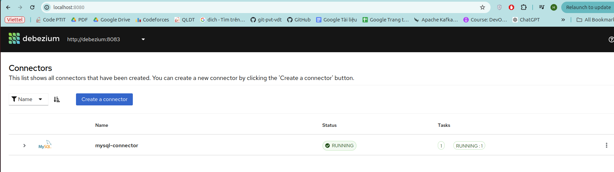
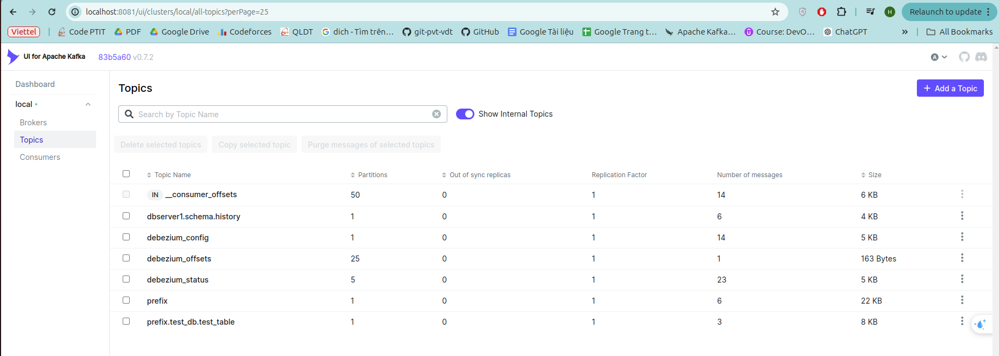
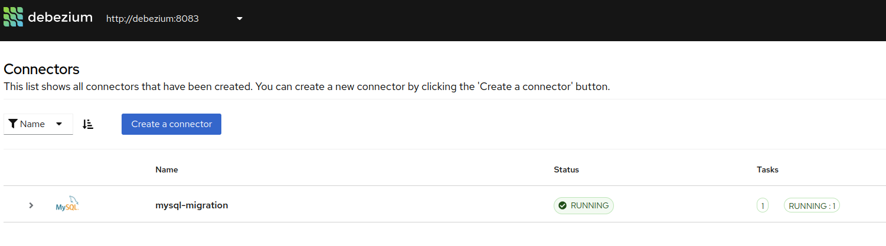
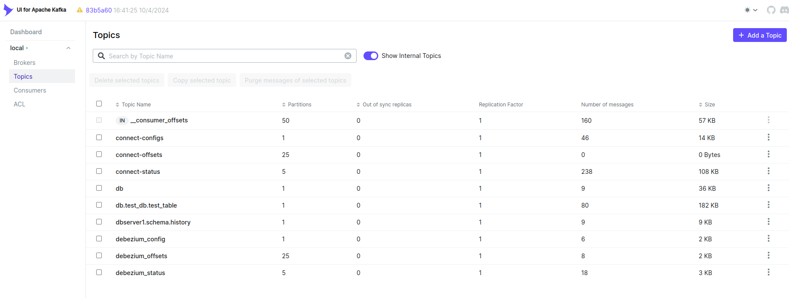

## Cấu hình MySQL

Tạo bảng trong MySQL:
Kết nối vào MySQL container:

```bash
docker exec -it mysql mysql -u debezium -p
```

Sử dụng mật khẩu `debezium` và sau đó tạo một bảng mẫu:

```
USE test_db;

CREATE TABLE test_table (
    id INT PRIMARY KEY AUTO_INCREMENT,
    name VARCHAR(255),
    created_at TIMESTAMP DEFAULT CURRENT_TIMESTAMP
);

INSERT INTO test_table (name) VALUES ('Alice'), ('Bob');
```
## Cấu hình Debezium Connector
```
  curl -X POST http://localhost:8083/connectors -H "Content-Type: application/json" -d '{
    "name": "mysql-migration",
    "config": {
      "topic.prefix": "db",
      "connector.class": "io.debezium.connector.mysql.MySqlConnector",
      "tasks.max": "1",
      "database.hostname": "mysql",
      "database.port": "3306",
      "database.user": "debezium",
      "database.password": "debezium",
      "database.server.id": "184054",
      "database.server.name": "dbserver1",
      "database.include.list": "test_db", 
      "table.include.list": ".*", 
      "database.history.kafka.bootstrap.servers": "kafka:19092",
      "database.history.kafka.topic": "dbserver1.history",
      "schema.history.internal.kafka.bootstrap.servers": "kafka:19092",
      "schema.history.internal.kafka.topic": "dbserver1.schema.history"
    }
  }'

>>>>
{"name":"mysql-connector","config":{"topic.prefix":"prefix","connector.class":"io.debezium.connector.mysql.MySqlConnector","tasks.max":"1","database.hostname":"mysql","database.port":"3306","database.user":"debezium","database.password":"debezium","database.server.id":"184054","database.server.name":"dbserver1","database.include.list":"test_db","table.include.list":"test_db.test_table","database.history.kafka.bootstrap.servers":"kafka:9092","database.history.kafka.topic":"dbserver1.history","schema.history.internal.kafka.bootstrap.servers":"kafka:9092","schema.history.internal.kafka.topic":"dbserver1.schema.history","name":"mysql-connector"},"tasks":[],"type":"source"}
```

## Docker logs cho debezium:
```
java.sql.SQLSyntaxErrorException: Access denied; you need (at least one of) the RELOAD or FLUSH_TABLES privilege(s) for this operation
```

==> Fix:
Kết nối vào MySQL container:

```bash
docker exec -it mysql mysql -u root -p
```

Nhập mật khẩu của tài khoản root (ở ví dụ là root) và chạy các lệnh sau để cấp quyền cần thiết:

```sql
GRANT RELOAD, SELECT, REPLICATION SLAVE, REPLICATION CLIENT ON *.* TO 'debezium'@'%';
FLUSH PRIVILEGES;
```

## Exec vào kafka để kiểm tra 
```bash
docker exec -it kafka bash
```

```
kafka-topics --bootstrap-server localhost:9092 --list 

>>>>
__consumer_offsets
dbserver1.schema.history
debezium_config
debezium_offsets
debezium_status
prefix
prefix.test_db.test_table
```


### Debezium UI


### Kafka UI


```
	
prefix.test_db.test_table 
1	0	1	3	8 KB
```


## Consumer:

```
kafka-console-consumer --bootstrap-server localhost:9092 --topic prefix.test_db.test_table --group my-second-application --from-beginning
```
```json
{"schema":{"type":"struct","fields":[{"type":"struct","fields":[{"type":"int32","optional":false,"field":"id"},{"type":"string","optional":true,"field":"name"},{"type":"string","optional":true,"name":"io.debezium.time.ZonedTimestamp","version":1,"field":"created_at"}],"optional":true,"name":"prefix.test_db.test_table.Value","field":"before"},{"type":"struct","fields":[{"type":"int32","optional":false,"field":"id"},{"type":"string","optional":true,"field":"name"},{"type":"string","optional":true,"name":"io.debezium.time.ZonedTimestamp","version":1,"field":"created_at"}],"optional":true,"name":"prefix.test_db.test_table.Value","field":"after"},{"type":"struct","fields":[{"type":"string","optional":false,"field":"version"},{"type":"string","optional":false,"field":"connector"},{"type":"string","optional":false,"field":"name"},{"type":"int64","optional":false,"field":"ts_ms"},{"type":"string","optional":true,"name":"io.debezium.data.Enum","version":1,"parameters":{"allowed":"true,last,false,incremental"},"default":"false","field":"snapshot"},{"type":"string","optional":false,"field":"db"},{"type":"string","optional":true,"field":"sequence"},{"type":"string","optional":true,"field":"table"},{"type":"int64","optional":false,"field":"server_id"},{"type":"string","optional":true,"field":"gtid"},{"type":"string","optional":false,"field":"file"},{"type":"int64","optional":false,"field":"pos"},{"type":"int32","optional":false,"field":"row"},{"type":"int64","optional":true,"field":"thread"},{"type":"string","optional":true,"field":"query"}],"optional":false,"name":"io.debezium.connector.mysql.Source","field":"source"},{"type":"string","optional":false,"field":"op"},{"type":"int64","optional":true,"field":"ts_ms"},{"type":"struct","fields":[{"type":"string","optional":false,"field":"id"},{"type":"int64","optional":false,"field":"total_order"},{"type":"int64","optional":false,"field":"data_collection_order"}],"optional":true,"name":"event.block","version":1,"field":"transaction"}],"optional":false,"name":"prefix.test_db.test_table.Envelope","version":1},"payload":{"before":null,"after":{"id":1,"name":"Alice","created_at":"2024-12-06T03:08:42Z"},"source":{"version":"2.4.2.Final","connector":"mysql","name":"prefix","ts_ms":1733455566000,"snapshot":"first","db":"test_db","sequence":null,"table":"test_table","server_id":0,"gtid":null,"file":"binlog.000002","pos":1526,"row":0,"thread":null,"query":null},"op":"r","ts_ms":1733455566643,"transaction":null}}
{"schema":{"type":"struct","fields":[{"type":"struct","fields":[{"type":"int32","optional":false,"field":"id"},{"type":"string","optional":true,"field":"name"},{"type":"string","optional":true,"name":"io.debezium.time.ZonedTimestamp","version":1,"field":"created_at"}],"optional":true,"name":"prefix.test_db.test_table.Value","field":"before"},{"type":"struct","fields":[{"type":"int32","optional":false,"field":"id"},{"type":"string","optional":true,"field":"name"},{"type":"string","optional":true,"name":"io.debezium.time.ZonedTimestamp","version":1,"field":"created_at"}],"optional":true,"name":"prefix.test_db.test_table.Value","field":"after"},{"type":"struct","fields":[{"type":"string","optional":false,"field":"version"},{"type":"string","optional":false,"field":"connector"},{"type":"string","optional":false,"field":"name"},{"type":"int64","optional":false,"field":"ts_ms"},{"type":"string","optional":true,"name":"io.debezium.data.Enum","version":1,"parameters":{"allowed":"true,last,false,incremental"},"default":"false","field":"snapshot"},{"type":"string","optional":false,"field":"db"},{"type":"string","optional":true,"field":"sequence"},{"type":"string","optional":true,"field":"table"},{"type":"int64","optional":false,"field":"server_id"},{"type":"string","optional":true,"field":"gtid"},{"type":"string","optional":false,"field":"file"},{"type":"int64","optional":false,"field":"pos"},{"type":"int32","optional":false,"field":"row"},{"type":"int64","optional":true,"field":"thread"},{"type":"string","optional":true,"field":"query"}],"optional":false,"name":"io.debezium.connector.mysql.Source","field":"source"},{"type":"string","optional":false,"field":"op"},{"type":"int64","optional":true,"field":"ts_ms"},{"type":"struct","fields":[{"type":"string","optional":false,"field":"id"},{"type":"int64","optional":false,"field":"total_order"},{"type":"int64","optional":false,"field":"data_collection_order"}],"optional":true,"name":"event.block","version":1,"field":"transaction"}],"optional":false,"name":"prefix.test_db.test_table.Envelope","version":1},"payload":{"before":null,"after":{"id":2,"name":"Bob","created_at":"2024-12-06T03:08:42Z"},"source":{"version":"2.4.2.Final","connector":"mysql","name":"prefix","ts_ms":1733455566000,"snapshot":"true","db":"test_db","sequence":null,"table":"test_table","server_id":0,"gtid":null,"file":"binlog.000002","pos":1526,"row":0,"thread":null,"query":null},"op":"r","ts_ms":1733455566645,"transaction":null}}
{"schema":{"type":"struct","fields":[{"type":"struct","fields":[{"type":"int32","optional":false,"field":"id"},{"type":"string","optional":true,"field":"name"},{"type":"string","optional":true,"name":"io.debezium.time.ZonedTimestamp","version":1,"field":"created_at"}],"optional":true,"name":"prefix.test_db.test_table.Value","field":"before"},{"type":"struct","fields":[{"type":"int32","optional":false,"field":"id"},{"type":"string","optional":true,"field":"name"},{"type":"string","optional":true,"name":"io.debezium.time.ZonedTimestamp","version":1,"field":"created_at"}],"optional":true,"name":"prefix.test_db.test_table.Value","field":"after"},{"type":"struct","fields":[{"type":"string","optional":false,"field":"version"},{"type":"string","optional":false,"field":"connector"},{"type":"string","optional":false,"field":"name"},{"type":"int64","optional":false,"field":"ts_ms"},{"type":"string","optional":true,"name":"io.debezium.data.Enum","version":1,"parameters":{"allowed":"true,last,false,incremental"},"default":"false","field":"snapshot"},{"type":"string","optional":false,"field":"db"},{"type":"string","optional":true,"field":"sequence"},{"type":"string","optional":true,"field":"table"},{"type":"int64","optional":false,"field":"server_id"},{"type":"string","optional":true,"field":"gtid"},{"type":"string","optional":false,"field":"file"},{"type":"int64","optional":false,"field":"pos"},{"type":"int32","optional":false,"field":"row"},{"type":"int64","optional":true,"field":"thread"},{"type":"string","optional":true,"field":"query"}],"optional":false,"name":"io.debezium.connector.mysql.Source","field":"source"},{"type":"string","optional":false,"field":"op"},{"type":"int64","optional":true,"field":"ts_ms"},{"type":"struct","fields":[{"type":"string","optional":false,"field":"id"},{"type":"int64","optional":false,"field":"total_order"},{"type":"int64","optional":false,"field":"data_collection_order"}],"optional":true,"name":"event.block","version":1,"field":"transaction"}],"optional":false,"name":"prefix.test_db.test_table.Envelope","version":1},"payload":{"before":null,"after":{"id":3,"name":"Charlie","created_at":"2024-12-06T03:17:44Z"},"source":{"version":"2.4.2.Final","connector":"mysql","name":"prefix","ts_ms":1733455566000,"snapshot":"last","db":"test_db","sequence":null,"table":"test_table","server_id":0,"gtid":null,"file":"binlog.000002","pos":1526,"row":0,"thread":null,"query":null},"op":"r","ts_ms":1733455566645,"transaction":null}}    
```


Note Connect:
```bash
  curl -X POST http://localhost:8083/connectors -H "Content-Type: application/json" -d '{
    "name": "mysql-connector",
    "config": {
      "topic.prefix": "prefix",
      "connector.class": "io.debezium.connector.mysql.MySqlConnector",
      "tasks.max": "1",
      "database.hostname": "mysql",
      "database.port": "3306",
      "database.user": "debezium",
      "database.password": "debezium",
      "database.server.id": "184054",
      "database.server.name": "dbserver1",
      "database.include.list": "test_db",
      "table.include.list": "test_db.test_table",
      "database.history.kafka.bootstrap.servers": "kafka:19092",
      "database.history.kafka.topic": "dbserver1.history",
      "schema.history.internal.kafka.bootstrap.servers": "kafka:19092",
      "schema.history.internal.kafka.topic": "dbserver1.schema.history"
    }
  }'
```

```bash
  curl -X POST http://localhost:8083/connectors -H "Content-Type: application/json" -d '{
    "name": "mysql-migration",
    "config": {
      "topic.prefix": "db",
      "connector.class": "io.debezium.connector.mysql.MySqlConnector",
      "tasks.max": "1",
      "database.hostname": "mysql",
      "database.port": "3306",
      "database.user": "debezium",
      "database.password": "debezium",
      "database.server.id": "184054",
      "database.server.name": "dbserver1",
      "database.include.list": "test_db", 
      "table.include.list": ".*", 
      "database.history.kafka.bootstrap.servers": "kafka:19092",
      "database.history.kafka.topic": "dbserver1.history",
      "schema.history.internal.kafka.bootstrap.servers": "kafka:19092",
      "schema.history.internal.kafka.topic": "dbserver1.schema.history"
    }
  }'

```


```
curl -X POST http://localhost:8084/connectors \
     -H "Content-Type: application/json" \
     -d @mysql-sink.json
```

Cannot invoke "org.apache.kafka.connect.runtime.rest.entities.CreateConnectorRequest.name()" because "createRequest" is null

curl -X POST http://localhost:8084/connectors -H "Content-Type: application/json" -d @mysql-sink.json


# Dùng Kafka-connect convert từ JSON (debezium) sang mysql

## Một số chú ý:


### Cài Đặt Debezium Plugin

Bị lỗi: Connector configuration is invalid and contains the following 1 error(s):\nInvalid value io.debezium.transforms.ExtractNewRecordState for configuration transforms.unwrap.type: Class io.debezium.transforms.ExtractNewRecordState could not be found

==> Debezium Transform chưa được cài đặt. 

```
docker exec -it kafka-connect bash
confluent-hub install --no-prompt debezium/debezium-connector-mysql:latest --component-dir /usr/share/confluent-hub-components

# Kiểm tra plugin đã cài thành công
ls /usr/share/confluent-hub-components
```

### 

Bị lỗi: org.apache.kafka.connect.errors.ConnectException: java.sql.SQLException: No suitable driver found for jdbc:mysql://target_mysql:3306/test_db?

==> Kafka Connect không tìm thấy MySQL JDBC Driver
```
docker exec -it kafka-connect bash
ls /usr/share/confluent-hub-components/

# Nếu thấy confluentinc-kafka-connect-jdbc, cần đặt MySQL JDBC driver vào đó.

# Tải MySQL JDBC Driver vào thư mục plugin

curl -o /usr/share/confluent-hub-components/confluentinc-kafka-connect-jdbc/mysql-connector-java-8.0.33.jar \
https://repo1.maven.org/maven2/mysql/mysql-connector-java/8.0.33/mysql-connector-java-8.0.33.jar
```

Xác nhận driver đã có:
```
ls /usr/share/confluent-hub-components/confluentinc-kafka-connect-jdbc/
```

Thêm `CONNECT_PLUGIN_PATH: "/usr/share/java,/usr/share/confluent-hub-components/"` vào kafka-connect trong docker compose 

#### Note: 
- Cài bản mysql-connector-j-8.0.33.jar thì mới nhận
- mysql jdbc này phải cùng thư mục với kafka-connect-jdbc-xxxx.jar

## Kết quả:



## Một số vấn đề cần xử lý:
- Chỉ lắng nghe thay đổi từ 1 bảng cụ thể, chưa xử lý lắng nghe từ nhiều bảng trong cùng 1 DB
- Đã xử lý được insert, update. Chưa xử lý được DELETE query, có 1 PR xử lý https://github.com/confluentinc/kafka-connect-jdbc/pull/282

