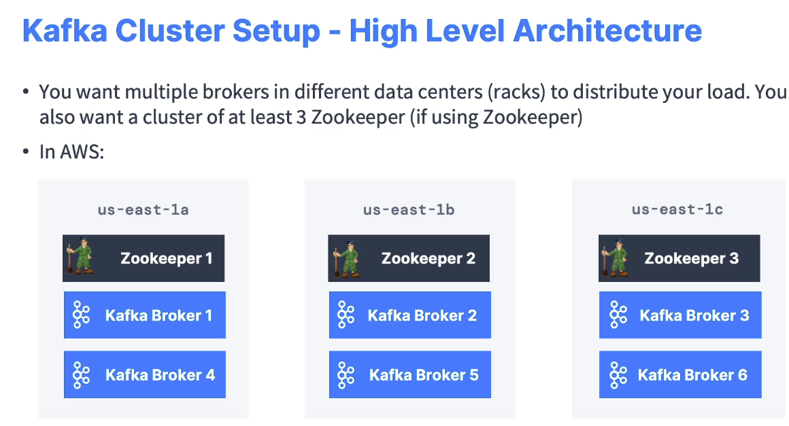
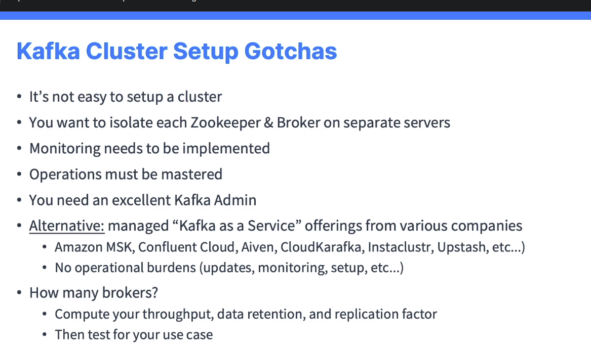
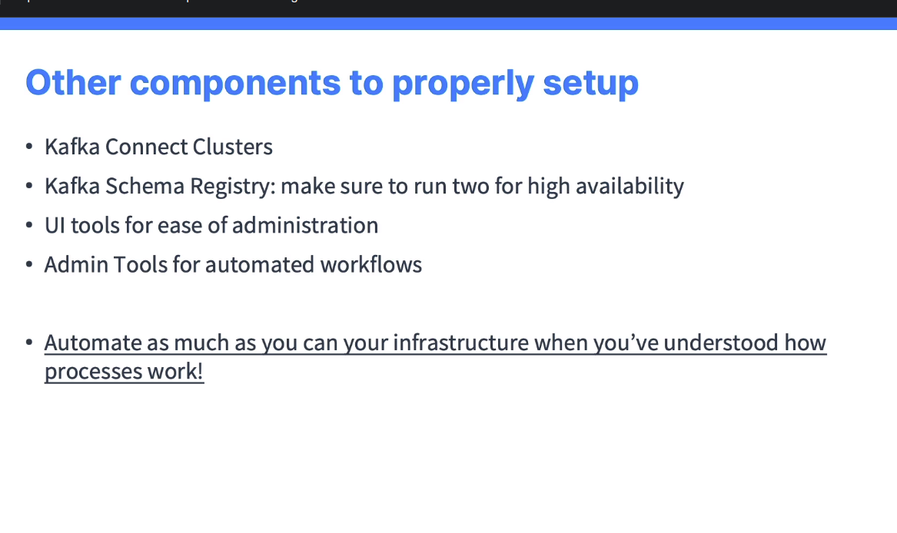

# Kafka in the Enterprise for Admins

## Monitoring 

## Operations

## Security

### Author

### 

## Kafka Multi Cluster

### Active / Active

### Active / Passive

## Advertised listeners

### Access within a private network

### Access within a public network

### Nếu để public accessible thì có thể là một mối nguy hiểm cho Enterprise
